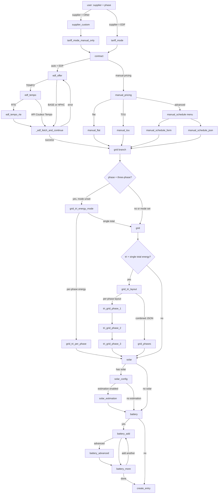

# Hub Énergie — configuration flow reference

This document describes the **initial setup** wizard (`HubEnergieConfigFlow`) in code: branch points, `step_id` values, and how they map to UI strings.

**On the documentation site**, users explore the flow with the **interactive preview** (generated from this integration) and see how entities are grouped per device in the **Devices** section. This markdown file does **not** inventory screenshot filenames; it stays the **developer reference** for branching and step ids.

**Interactive preview (doc site):** `python scripts/extract_config_flow_catalog.py` regenerates `site/src/data/flowCatalog.generated.json` from `config_flow.py` (AST) + `strings.json` (labels) + `selector` option text. The documentation page mounts a **non-executable** wizard shell whose **branching follows this guide** (user choices drive the next `step_id`; there is no HA validation or network I/O). GitLab CI runs the same script with `--check` so the committed JSON cannot drift silently. **`tests/test_flow_catalog_coverage.py`** asserts every `async_step_*` on `HubEnergieConfigFlow` / `_BatteryWizardMixin` has a catalog row and that the committed file matches a fresh extract. If your environment has `pytest-cov` but these tests must not measure coverage, use `pytest … --no-cov`; without the plugin, use `pytest … --override-ini addopts=` so `pytest.ini` does not inject `--cov`.

**HA ↔ vitrine parity:** Any change to wizard steps, schemas, `section()` groups, selectors, or strings must be reflected **both** in the integration (`config_flow.py`, `strings.json`, `translations/*.json`) **and** in the vitrine: rerun the extract script above, and adjust `site/src/components/FlowSimulator.vue` or the extract script if a new pattern is not covered generically. The project Cursor rule `.cursor/rules/config-flow-vitrine-parity.mdc` restates this checklist for agents.

**Doc site release label:** User-visible “doc snapshot **v…**” strings and HTML fallbacks use placeholders expanded at **build time** from **`manifest.json` → `version`** (`{{HUB_ENERGIE_VERSION}}`, `{{HUB_ENERGIE_VERSION_SERIES}}`) plus the doc bundle date (`{{HUB_ENERGIE_DOC_SNAPSHOT_ISO_DATE}}`, UTC `YYYY-MM-DD`); see `site/scripts/manifest-version.mjs` and `site/scripts/build-i18n.mjs`.

- **Implementation:** `config_flow.py` → class `HubEnergieConfigFlow` (flow `VERSION = 4`).
- **Dialog titles/descriptions (EN):** `translations/en.json` under `config.step.<step_id>`.
- **French:** `translations/fr.json` (same keys).

---

## 1. Branch overview

The flow is **not linear**. Path depends on supplier, automatic vs manual tariffs, EDF offer (BASE / HPHC / TEMPO), Tempo signal source (RTE vs API Couleur Tempo), phase type (mono vs tri), and optional solar/batteries.

---

## 2. Step reference (initial config)

| `step_id` | When it runs | Typical next step(s) |
|-----------|----------------|----------------------|
| `user` | Always first | `supplier_custom` if Other, else `tariff_mode` |
| `supplier_custom` | Supplier = Other | `tariff_mode_manual_only` |
| `tariff_mode_manual_only` | After Other supplier | `contract` (confirms manual-only; sets internal mode) |
| `tariff_mode` | Supplier = EDF | `contract` |
| `contract` | After tariff mode resolved | If auto+EDF → `edf_offer`; else → `manual_pricing` |
| `edf_offer` | EDF + automatic tariffs | TEMPO → `edf_tempo`; else → `_edf_fetch_and_continue` |
| `edf_tempo` | TEMPO offer | RTE → `edf_tempo_rte`; else → `_edf_fetch_and_continue` |
| `edf_tempo_rte` | Tempo + RTE | Validates credentials → `_edf_fetch_and_continue` |
| _(internal)_ `_edf_fetch_and_continue` | After offer/tempo resolved | Fetches EDF JSON; on failure returns to `edf_offer` with error; on success → `grid` |
| `manual_pricing` | Manual tariffs | `manual_flat` / `manual_tou` / `manual_schedule` |
| `manual_flat` | Flat rate | `grid` |
| `manual_tou` | Peak/off-peak — two time slots (form) | `grid` |
| `manual_schedule` | Menu | `manual_schedule_form` or `manual_schedule_json` |
| `manual_schedule_form` | Form slots | `grid` |
| `manual_schedule_json` | JSON slots | `grid` |
| `grid_tri_energy_mode` | Three-phase, energy mode not set | Per-phase → `grid_tri_per_phase` → `solar`; single total → `grid` |
| `grid` | Grid sensors (mono or tri total path) | Tri with combined metering → `grid_tri_layout`; else → `solar` |
| `grid_tri_per_phase` | Tri + per-phase import meters | `solar` |
| `grid_tri_layout` | Tri + single total energy | Per-phase optional sensors → `tri_grid_phase_1`; else `grid_phases` |
| `grid_phases` | Tri + JSON lists for phases | `solar` |
| `tri_grid_phase_1` … `tri_grid_phase_3` | Tri + optional per-phase sensors | Chain L1→L2→L3, then `solar` |
| `solar` | Solar yes/no | Yes → `solar_config`; no → `battery` |
| `solar_config` | Solar enabled | Estimation on → `solar_estimation`; else → `battery` |
| `solar_estimation` | Clear-sky model | `battery` |
| `battery` | Batteries yes/no | Yes → `battery_add`; no → `_create_entry` |
| `battery_add` | Define one battery | Advanced → `battery_advanced`; else → `battery_more` |
| `battery_advanced` | Extra battery fields | `battery_more` |
| `battery_more` | Add another battery? | Yes → `battery_add`; no → `_create_entry` |
| _(internal)_ `_create_entry` | End | Creates config entry or shows validation errors |

---

## 3. Options flow (after setup)

Post-setup changes use `HubEnergieOptionsFlow` (menu entries depend on config: offer, grid, optional `grid_tri`, solar, battery, and for EDF possibly `tariff_refresh` and `tempo`). Advanced tuning is grouped under **`expert`**: a submenu with `reinjection`, `advanced_energy`, and `expert_back` (return to the main options menu). This guide focuses on **initial** setup; options reuse many of the same step schemas. After install, **entity grouping per device** is illustrated on the doc site under **Devices** (compact HTML preview, not a second config-flow walkthrough).

---

## 4. Documentation site (vitrine)

| Area | Role |
|------|------|
| **Interactive flow preview** | Walks `step_id`s with the same labels and branching as Home Assistant (no entity validation, no network). Anchors: doc **Configuration** section. |
| **Devices** | Per-device sensor lists (mock UI) for how Home Assistant presents **Offre**, **Réseau**, **Solaire**, batteries, etc., after setup. |
| **Setup & options — step help** | Short explainers linked from HA dialogs; deep links by anchor. |

Strings and layout for the main doc page live under `site/lang/*/doc.json` and Vue partials. After changing integration copy, run `node site/scripts/build-i18n.mjs` (or `npm run build` in `site/`) so the merged bundle updates.

---

## 5. Related docs

- Advanced schedule slots (manual schedule JSON): `advanced-schedule-slots.md`
- Runtime issues: `troubleshooting.md`
