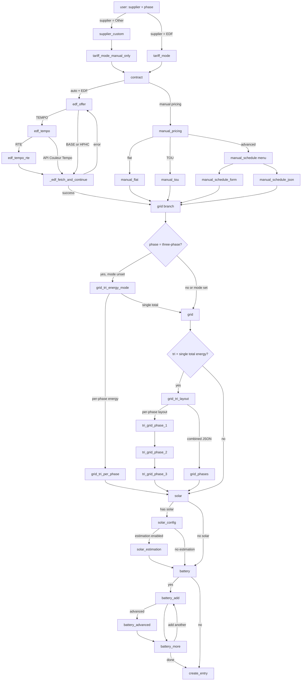

# Hub Énergie — configuration flow reference

This document describes the **initial setup** wizard (`HubEnergieConfigFlow`) in code: branch points, `step_id` values, and how they map to UI strings. It also tracks **documentation screenshots** under `site/public/img/` (GitLab Pages). The vitrine still references **fixed** `config-flow-*.png` names in `doc-fragment.html` — any missing file shows a **placeholder** in the carousel. For the **Tempo · RTE** tab, the intended sequence is **`config-flow-edf-01-user.png` → … → `config-flow-edf-06-rte-credentials.png`** (see §4.1).

**Interactive preview (doc site):** `python scripts/extract_config_flow_catalog.py` regenerates `site/src/data/flowCatalog.generated.json` from `config_flow.py` (AST) + `strings.json` (labels). The documentation page mounts a **non-executable** wizard shell (linear **sample paths** only). GitLab CI runs the same script with `--check` so the committed JSON cannot drift silently. **`tests/test_flow_catalog_coverage.py`** asserts every `async_step_*` on `HubEnergieConfigFlow` / `_BatteryWizardMixin` has a catalog row and that the committed file matches a fresh extract. If your environment has `pytest-cov` but these tests must not measure coverage, use `pytest … --no-cov`; without the plugin, use `pytest … --override-ini addopts=` so `pytest.ini` does not inject `--cov`. For the **guided tour** (tabs), see §6 (`#/doc#configure-paths`).

- **Implementation:** `config_flow.py` → class `HubEnergieConfigFlow` (flow `VERSION = 2`).
- **Dialog titles/descriptions (EN):** `translations/en.json` under `config.step.<step_id>`.
- **French:** `translations/fr.json` (same keys).

---

## 1. Branch overview

The flow is **not linear**. Path depends on supplier, automatic vs manual tariffs, EDF offer (BASE / HPHC / TEMPO), Tempo signal source (RTE vs API Couleur Tempo), phase type (mono vs tri), and optional solar/batteries.

---

## 2. Step reference (initial config)

| `step_id` | When it runs | Typical next step(s) |
|-----------|----------------|----------------------|
| `user` | Always first | `supplier_custom` if Other, else `tariff_mode` |
| `supplier_custom` | Supplier = Other | `tariff_mode_manual_only` |
| `tariff_mode_manual_only` | After Other supplier | `contract` (confirms manual-only; sets internal mode) |
| `tariff_mode` | Supplier = EDF | `contract` |
| `contract` | After tariff mode resolved | If auto+EDF → `edf_offer`; else → `manual_pricing` |
| `edf_offer` | EDF + automatic tariffs | TEMPO → `edf_tempo`; else → `_edf_fetch_and_continue` |
| `edf_tempo` | TEMPO offer | RTE → `edf_tempo_rte`; else → `_edf_fetch_and_continue` |
| `edf_tempo_rte` | Tempo + RTE | Validates credentials → `_edf_fetch_and_continue` |
| _(internal)_ `_edf_fetch_and_continue` | After offer/tempo resolved | Fetches EDF JSON; on failure returns to `edf_offer` with error; on success → `grid` |
| `manual_pricing` | Manual tariffs | `manual_flat` / `manual_tou` / `manual_schedule` |
| `manual_flat` | Flat rate | `grid` |
| `manual_tou` | Peak/off-peak — two time slots (form) | `grid` |
| `manual_schedule` | Menu | `manual_schedule_form` or `manual_schedule_json` |
| `manual_schedule_form` | Form slots | `grid` |
| `manual_schedule_json` | JSON slots | `grid` |
| `grid_tri_energy_mode` | Three-phase, energy mode not set | Per-phase → `grid_tri_per_phase` → `solar`; single total → `grid` |
| `grid` | Grid sensors (mono or tri total path) | Tri with combined metering → `grid_tri_layout`; else → `solar` |
| `grid_tri_per_phase` | Tri + per-phase import meters | `solar` |
| `grid_tri_layout` | Tri + single total energy | Per-phase optional sensors → `tri_grid_phase_1`; else `grid_phases` |
| `grid_phases` | Tri + JSON lists for phases | `solar` |
| `tri_grid_phase_1` … `tri_grid_phase_3` | Tri + optional per-phase sensors | Chain L1→L2→L3, then `solar` |
| `solar` | Solar yes/no | Yes → `solar_config`; no → `battery` |
| `solar_config` | Solar enabled | Estimation on → `solar_estimation`; else → `battery` |
| `solar_estimation` | Clear-sky model | `battery` |
| `battery` | Batteries yes/no | Yes → `battery_add`; no → `_create_entry` |
| `battery_add` | Define one battery | Advanced → `battery_advanced`; else → `battery_more` |
| `battery_advanced` | Extra battery fields | `battery_more` |
| `battery_more` | Add another battery? | Yes → `battery_add`; no → `_create_entry` |
| _(internal)_ `_create_entry` | End | Creates config entry or shows validation errors |

---

## 3. Options flow (after setup)

Post-setup changes use `HubEnergieOptionsFlow` (menu entries depend on config: offer, grid, optional `grid_tri`, solar, battery, and for EDF possibly `tariff_refresh` and `tempo`). This guide focuses on **initial** setup; options reuse many of the same step schemas. Screenshots for **Settings → Hub Énergie → Configure** are optional for this doc.

---

## 4. Screenshot inventory (`site/public/img/`)

**Status:** Filenames below are what **`site/src/assets/doc-fragment.html`** and §5 expect — commit PNGs with these exact names (or update HTML + i18n if you rename). Slides without a file keep the site placeholder.

**Internal step with no success dialog:** `_edf_fetch_and_continue` goes straight to `grid` on success. On failure, `edf_offer` may reappear with an error — optional capture.

### 4.1 Filenames wired on the doc site (carousels)

| File | Maps to `step_id` (intent) | Used in tab |
|------|---------------------------|-------------|
| `site/public/img/config-flow-edf-01-user.png` | `user` | RTE, API, Manual |
| `site/public/img/config-flow-edf-02-tariff-mode.png` | `tariff_mode` | RTE, API |
| `site/public/img/config-flow-edf-03-contract.png` | `contract` | RTE, API, Manual |
| `site/public/img/config-flow-edf-04-edf-offer.png` | `edf_offer` | RTE, API, EDF offers |
| `site/public/img/config-flow-edf-05-tempo-source.png` | `edf_tempo` | RTE, API (slide before API Couleur or RTE creds) |
| `site/public/img/config-flow-edf-06-rte-credentials.png` | `edf_tempo_rte` | RTE only |
| `site/public/img/config-flow-edf-tempo-api-couleur.png` | `edf_tempo` | API only (last slide) |
| `site/public/img/config-flow-edf-offer-base.png` | `edf_offer` | EDF offers |
| `site/public/img/config-flow-edf-offer-hphc.png` | `edf_offer` | EDF offers |
| `site/public/img/config-flow-tariff-mode-manual.png` | `tariff_mode` | Manual |
| `site/public/img/config-flow-manual-pricing-flat.png` | `manual_pricing` | Manual |
| `site/public/img/config-flow-manual-flat.png` | `manual_flat` | Manual |
| `site/public/img/config-flow-grid-mono.png` | `grid` | Manual |

If your new UI **no longer matches** these steps (extra screens, merged dialogs, renamed flow), update `doc-fragment.html` + `i18n.js` to match reality.

### 4.2 Extra filenames (checklist / future carousels — not all in HTML today)

| File | Maps to `step_id` |
|------|-------------------|
| `site/public/img/config-flow-other-supplier-custom.png` | `supplier_custom` |
| `site/public/img/config-flow-tariff-manual-only-info.png` | `tariff_mode_manual_only` |
| `site/public/img/config-flow-manual-pricing-tou.png` | `manual_pricing` (TOU branch) |
| `site/public/img/config-flow-manual-tou.png` | `manual_tou` |
| `site/public/img/config-flow-manual-schedule-menu.png` | `manual_schedule` |
| `site/public/img/config-flow-manual-schedule-form.png` | `manual_schedule_form` |
| `site/public/img/config-flow-manual-schedule-json.png` | `manual_schedule_json` |
| `site/public/img/config-flow-edf-fetch-error.png` | `edf_offer` (after failed fetch), optional |
| `site/public/img/config-flow-grid-tri-energy-mode.png` | `grid_tri_energy_mode` |
| `site/public/img/config-flow-grid-tri-per-phase.png` | `grid_tri_per_phase` |
| `site/public/img/config-flow-grid-mono-or-tri-total.png` | `grid` (tri total) |
| `site/public/img/config-flow-grid-tri-layout.png` | `grid_tri_layout` |
| `site/public/img/config-flow-grid-phases-json.png` | `grid_phases` |
| `site/public/img/config-flow-grid-tri-phase-l1.png` | `tri_grid_phase_1` |
| `site/public/img/config-flow-solar-toggle.png` | `solar` |
| `site/public/img/config-flow-solar-config.png` | `solar_config` |
| `site/public/img/config-flow-solar-estimation.png` | `solar_estimation` |
| `site/public/img/config-flow-battery-toggle.png` | `battery` |
| `site/public/img/config-flow-battery-add.png` | `battery_add` |
| `site/public/img/config-flow-battery-advanced.png` | `battery_advanced` |
| `site/public/img/config-flow-battery-more.png` | `battery_more` |
| `site/public/img/config-options-menu.png` | options menu |
| `site/public/img/config-options-tempo.png` | options tempo / RTE |

### 4.3 Not part of config flow (other doc assets)

These are useful for the same documentation site but are **not** config-flow steps:

| File | Purpose |
|------|---------|
| `site/public/img/hub-energie-card.png` | Lovelace card on dashboard |
| `site/public/img/lovelace-editor-01.png` | Card visual editor |
| `site/public/img/integration-devices-overview.png` | Integration entry + device list |
| `site/public/img/device-ui-01-offre.png` | Device **Offre** detail (post-setup) |

### 4.4 Device UI captures (doc carousel)

The doc site uses `site/public/img/device-ui-01-offre.png` … `device-ui-08-diagnostics.png` for the per-device gallery (**not** config-flow steps).

---

## 5. Missing screenshots checklist (reset)

Tick items as you drop files into `site/public/img/`. After a **flow redesign**, verify §4.1 still matches `doc-fragment.html`.

### Priority — doc carousels (§4.1)

- [ ] **`config-flow-edf-01-user.png`** — `user`
- [ ] **`config-flow-edf-02-tariff-mode.png`** — `tariff_mode`
- [ ] **`config-flow-edf-03-contract.png`** — `contract`
- [ ] **`config-flow-edf-04-edf-offer.png`** — `edf_offer`
- [ ] **`config-flow-edf-05-tempo-source.png`** — `edf_tempo`
- [ ] **`config-flow-edf-06-rte-credentials.png`** — `edf_tempo_rte`
- [ ] **`config-flow-edf-tempo-api-couleur.png`** — `edf_tempo` (API Couleur branch)
- [ ] **`config-flow-edf-offer-base.png`** / **`config-flow-edf-offer-hphc.png`** — `edf_offer` variants
- [ ] **`config-flow-tariff-mode-manual.png`** — `tariff_mode` (manual)
- [ ] **`config-flow-manual-pricing-flat.png`** — `manual_pricing` (flat)
- [ ] **`config-flow-manual-flat.png`** — `manual_flat`
- [ ] **`config-flow-grid-mono.png`** — `grid` (mono)

### A. EDF automatic — optional / extra

- [ ] **`config-flow-edf-fetch-error.png`** — failed `_edf_fetch_and_continue` / error on offer step (optional).

### B. Other supplier + manual-only

- [ ] **`config-flow-other-supplier-custom.png`** — `supplier_custom`
- [ ] **`config-flow-tariff-manual-only-info.png`** — `tariff_mode_manual_only`
- [ ] **`config-flow-manual-pricing-tou.png`** — `manual_pricing` (TOU)
- [ ] **`config-flow-manual-tou.png`** — `manual_tou`
- [ ] **`config-flow-manual-schedule-menu.png`** — `manual_schedule`
- [ ] **`config-flow-manual-schedule-form.png`** — `manual_schedule_form`
- [ ] **`config-flow-manual-schedule-json.png`** — `manual_schedule_json`

### C. EDF + manual (overlap with §B for pricing steps)

- [ ] **`config-flow-edf-manual-contract.png`** _(optional)_ — `contract` in the same walk-through as manual mode.

### D. Grid — three-phase

- [ ] **`config-flow-grid-tri-energy-mode.png`** — `grid_tri_energy_mode`
- [ ] **`config-flow-grid-tri-per-phase.png`** — `grid_tri_per_phase`
- [ ] **`config-flow-grid-mono-or-tri-total.png`** — `grid` (tri + single total), if useful
- [ ] **`config-flow-grid-tri-layout.png`** — `grid_tri_layout`
- [ ] **`config-flow-grid-phases-json.png`** — `grid_phases`
- [ ] **`config-flow-grid-tri-phase-l1.png`** — `tri_grid_phase_1` (+ L2/L3 if needed)

### F. Solar

- [ ] **`config-flow-solar-toggle.png`** — `solar`
- [ ] **`config-flow-solar-config.png`** — `solar_config`
- [ ] **`config-flow-solar-estimation.png`** — `solar_estimation`

### G. Batteries

- [ ] **`config-flow-battery-toggle.png`** — `battery`
- [ ] **`config-flow-battery-add.png`** — `battery_add`
- [ ] **`config-flow-battery-advanced.png`** — `battery_advanced`
- [ ] **`config-flow-battery-more.png`** — `battery_more`

### H. Options (post-setup)

- [ ] **`config-options-menu.png`**
- [ ] **`config-options-tempo.png`**

---

## 6. Guided doc site vs this file

**End users (GitLab Pages / showcase site)** — Under **Configure in Home Assistant**, open **Guided screenshot paths** (`#configure-paths`). Bootstrap **tabs** switch between screenshot carousels (missing §4.1 assets show **placeholders**):

| Tab | Purpose |
|-----|---------|
| **Tempo · RTE** | Six-step path: `config-flow-edf-01-user.png` … `config-flow-edf-06-rte-credentials.png`. |
| **Tempo · API** | Same through offer, then `config-flow-edf-tempo-api-couleur.png` (no RTE credentials slide). |
| **Manual tariffs** | `user` → manual `tariff_mode` → `contract` → `manual_pricing` (flat) → `manual_flat` → mono `grid`. |
| **EDF offers** | `config-flow-edf-offer-base.png`, `config-flow-edf-offer-hphc.png`, `config-flow-edf-04-edf-offer.png`. |

Strings live in `site/public/i18n.js`; layout in `site/src/assets/doc-fragment.html`. After changing i18n, run `node site/scripts/sync-public.mjs` (or `npm run build` in `site/`, which runs it in `prebuild`).

**This markdown file** stays the **developer reference**: `step_id` table, mermaid graph, screenshot inventory, and missing checklist (§5).

**Next assets** — Commit new PNGs under `site/public/img/` using the names in §5. Prefer **extra** files per branch rather than overwriting the canonical RTE set. Further tabs (e.g. three-phase grid only) can follow the same pattern as in `DocView.vue` (`wireCarouselPair`).

---

## 7. Related docs

- Advanced schedule slots (manual schedule JSON): `advanced-schedule-slots.md`
- Runtime issues: `troubleshooting.md`
