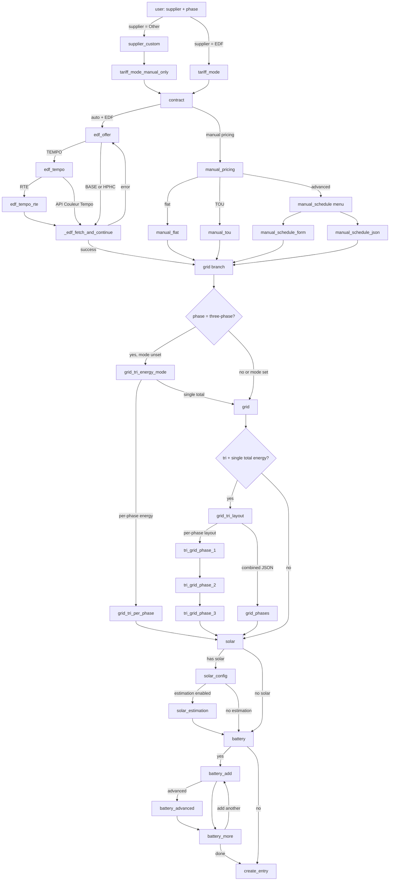

# Hub Énergie — configuration flow reference

This document describes the **initial setup** wizard (`HubEnergieConfigFlow`) in code: branch points, `step_id` values, and how they map to UI strings. It also tracks **documentation screenshots** (stored at the **repository root** in `public/img/` for GitLab Pages) and lists **what is still missing**.

- **Implementation:** `config_flow.py` → class `HubEnergieConfigFlow` (flow `VERSION = 2`).
- **Dialog titles/descriptions (EN):** `translations/en.json` under `config.step.<step_id>`.
- **French:** `translations/fr.json` (same keys).

---

## 1. Branch overview

The flow is **not linear**. Path depends on supplier, automatic vs manual tariffs, EDF offer (BASE / HPHC / TEMPO), Tempo signal source (RTE vs API Couleur Tempo), phase type (mono vs tri), and optional solar/batteries.

---

## 2. Step reference (initial config)

| `step_id` | When it runs | Typical next step(s) |
|-----------|----------------|----------------------|
| `user` | Always first | `supplier_custom` if Other, else `tariff_mode` |
| `supplier_custom` | Supplier = Other | `tariff_mode_manual_only` |
| `tariff_mode_manual_only` | After Other supplier | `contract` (confirms manual-only; sets internal mode) |
| `tariff_mode` | Supplier = EDF | `contract` |
| `contract` | After tariff mode resolved | If auto+EDF → `edf_offer`; else → `manual_pricing` |
| `edf_offer` | EDF + automatic tariffs | TEMPO → `edf_tempo`; else → `_edf_fetch_and_continue` |
| `edf_tempo` | TEMPO offer | RTE → `edf_tempo_rte`; else → `_edf_fetch_and_continue` |
| `edf_tempo_rte` | Tempo + RTE | Validates credentials → `_edf_fetch_and_continue` |
| _(internal)_ `_edf_fetch_and_continue` | After offer/tempo resolved | Fetches EDF JSON; on failure returns to `edf_offer` with error; on success → `grid` |
| `manual_pricing` | Manual tariffs | `manual_flat` / `manual_tou` / `manual_schedule` |
| `manual_flat` | Flat rate | `grid` |
| `manual_tou` | Peak/off-peak JSON | `grid` |
| `manual_schedule` | Menu | `manual_schedule_form` or `manual_schedule_json` |
| `manual_schedule_form` | Form slots | `grid` |
| `manual_schedule_json` | JSON slots | `grid` |
| `grid_tri_energy_mode` | Three-phase, energy mode not set | Per-phase → `grid_tri_per_phase` → `solar`; single total → `grid` |
| `grid` | Grid sensors (mono or tri total path) | Tri with combined metering → `grid_tri_layout`; else → `solar` |
| `grid_tri_per_phase` | Tri + per-phase import meters | `solar` |
| `grid_tri_layout` | Tri + single total energy | Per-phase optional sensors → `tri_grid_phase_1`; else `grid_phases` |
| `grid_phases` | Tri + JSON lists for phases | `solar` |
| `tri_grid_phase_1` … `tri_grid_phase_3` | Tri + optional per-phase sensors | Chain L1→L2→L3, then `solar` |
| `solar` | Solar yes/no | Yes → `solar_config`; no → `battery` |
| `solar_config` | Solar enabled | Estimation on → `solar_estimation`; else → `battery` |
| `solar_estimation` | Clear-sky model | `battery` |
| `battery` | Batteries yes/no | Yes → `battery_add`; no → `_create_entry` |
| `battery_add` | Define one battery | Advanced → `battery_advanced`; else → `battery_more` |
| `battery_advanced` | Extra battery fields | `battery_more` |
| `battery_more` | Add another battery? | Yes → `battery_add`; no → `_create_entry` |
| _(internal)_ `_create_entry` | End | Creates config entry or shows validation errors |

---

## 3. Options flow (after setup)

Post-setup changes use `HubEnergieOptionsFlow` (menu entries depend on config: offer, grid, optional `grid_tri`, solar, battery, and for EDF possibly `tariff_refresh` and `tempo`). This guide focuses on **initial** setup; options reuse many of the same step schemas. Screenshots for **Settings → Hub Énergie → Configure** are optional for this doc.

---

## 4. Screenshot inventory (`public/img/`)

These files live at the **repository root** (`public/img/`), not inside `custom_components/`. They are referenced by the static doc site (`public/index.html`).

### 4.1 Covered today (initial flow — one path)

The following **six** files document a single happy path: **EDF · mono · automatic tariffs · TEMPO · RTE**.

| File | Maps to `step_id` | Notes |
|------|-------------------|--------|
| `public/img/config-flow-edf-01-user.png` | `user` | Supplier + phase on one form |
| `public/img/config-flow-edf-02-tariff-mode.png` | `tariff_mode` | Automatic vs manual |
| `public/img/config-flow-edf-03-contract.png` | `contract` | kVA + optional name |
| `public/img/config-flow-edf-04-edf-offer.png` | `edf_offer` | BASE / HPHC / TEMPO |
| `public/img/config-flow-edf-05-tempo-source.png` | `edf_tempo` | RTE vs API Couleur Tempo |
| `public/img/config-flow-edf-06-rte-credentials.png` | `edf_tempo_rte` | Client ID + secret |

**Not shown as a separate screen (by design):** `_edf_fetch_and_continue` has **no dedicated dialog** on success—it immediately continues to `grid`. A fetch **failure** can re-show `edf_offer` with a form error (optional screenshot for troubleshooting docs).

### 4.2 Not part of config flow (other doc assets)

These are useful for the same documentation site but are **not** config-flow steps:

| File | Purpose |
|------|---------|
| `public/img/hub-energie-card.png` | Lovelace card on dashboard |
| `public/img/lovelace-editor-01.png` | Card visual editor |
| `public/img/integration-devices-overview.png` | Integration entry + device list |
| `public/img/device-ui-01-offre.png` | Device **Offre** detail (post-setup) |

### 4.3 Per-device gallery placeholders (still mostly missing)

The site expects `public/img/device-ui-02-reseau.png` … `device-ui-08-diagnostics.png` for the device carousel; only **Offre** is filled (`device-ui-01-offre.png`). That gap is **device UI**, not config flow—listed here only so you do not confuse it with setup steps.

---

## 5. Missing screenshots checklist (for you)

Use consistent naming under `public/img/` when you capture them. Grouped by branch.

### A. EDF automatic — alternatives to the documented path

- [ ] **`config-flow-edf-tempo-api-couleur.png`** — `edf_tempo` with **API Couleur Tempo** selected (no RTE screen next).
- [ ] **`config-flow-edf-offer-base-or-hphc.png`** — `edf_offer` with **BASE or HPHC** selected (and ideally the **next** screen after successful fetch: first `grid` field), or `edf_offer` showing a **fetch error** if you document troubleshooting.
- [ ] _(Optional)_ **`config-flow-edf-fetch-error.png`** — `edf_offer` with `errors.base` after a failed `_edf_fetch_and_continue`.

### B. Other supplier + manual-only path

- [ ] **`config-flow-other-supplier-custom.png`** — `supplier_custom` (name field).
- [ ] **`config-flow-tariff-manual-only-info.png`** — `tariff_mode_manual_only` (informational step before contract).
- [ ] **`config-flow-manual-pricing.png`** — `manual_pricing` (structure, price basis, currency).
- [ ] **`config-flow-manual-flat.png`** — `manual_flat`.
- [ ] **`config-flow-manual-tou.png`** — `manual_tou` (JSON periods).
- [ ] **`config-flow-manual-schedule-menu.png`** — `manual_schedule` (menu: form vs JSON).
- [ ] **`config-flow-manual-schedule-form.png`** — `manual_schedule_form`.
- [ ] **`config-flow-manual-schedule-json.png`** — `manual_schedule_json`.

### C. EDF + manual tariffs

Same manual pricing steps as section B after `contract` (no `edf_offer` / Tempo). At minimum:

- [ ] **`config-flow-edf-manual-after-contract.png`** — first manual step after EDF + manual mode selected (typically `manual_pricing`).

### D. Grid — single-phase

- [ ] **`config-flow-grid-mono.png`** — `grid` (import required, optional export/power/sign convention/load power).

### E. Grid — three-phase

Capture the branches you want to document (users only see one path per install):

- [ ] **`config-flow-grid-tri-energy-mode.png`** — `grid_tri_energy_mode`.
- [ ] **`config-flow-grid-tri-per-phase.png`** — `grid_tri_per_phase`.
- [ ] **`config-flow-grid-mono-or-tri-total.png`** — `grid` for tri with **single total** import (if distinct from mono visually).
- [ ] **`config-flow-grid-tri-layout.png`** — `grid_tri_layout`.
- [ ] **`config-flow-grid-phases-json.png`** — `grid_phases`.
- [ ] **`config-flow-grid-tri-phase-l1.png`** — `tri_grid_phase_1` (and optionally L2/L3 or a note that they look the same).

### F. Solar

- [ ] **`config-flow-solar-toggle.png`** — `solar` (yes/no).
- [ ] **`config-flow-solar-config.png`** — `solar_config` (entities, resale, estimation toggle, etc.).
- [ ] **`config-flow-solar-estimation.png`** — `solar_estimation` (only if estimation enabled).

### G. Batteries

- [ ] **`config-flow-battery-toggle.png`** — `battery`.
- [ ] **`config-flow-battery-add.png`** — `battery_add` (first battery).
- [ ] **`config-flow-battery-advanced.png`** — `battery_advanced` (if you enable advanced).
- [ ] **`config-flow-battery-more.png`** — `battery_more` (“add another”).

### H. Options flow (optional)

- [ ] **`config-options-menu.png`** — main options menu for a representative entry (EDF Tempo tri + solar + batteries).
- [ ] **`config-options-tempo.png`** — `tempo` / `tempo_rte` steps in options if different from initial setup.

---

## 6. Suggested next actions

1. **Commit** new PNGs under `public/img/` with the names above (or rename to match what `public/index.html` / future sections expect).
2. **Extend** `public/index.html` + `public/i18n.js` with extra carousels or accordions per branch (e.g. “Manual pricing”, “Three-phase grid”) so readers are not forced through one linear slideshow.
3. Keep **`config-flow-edf-*.png`** as the **canonical EDF auto TEMPO RTE** story; add parallel filenames for other branches instead of overwriting.

---

## 7. Related docs

- Advanced schedule slots (manual schedule JSON): `advanced-schedule-slots.md`
- Runtime issues: `troubleshooting.md`
